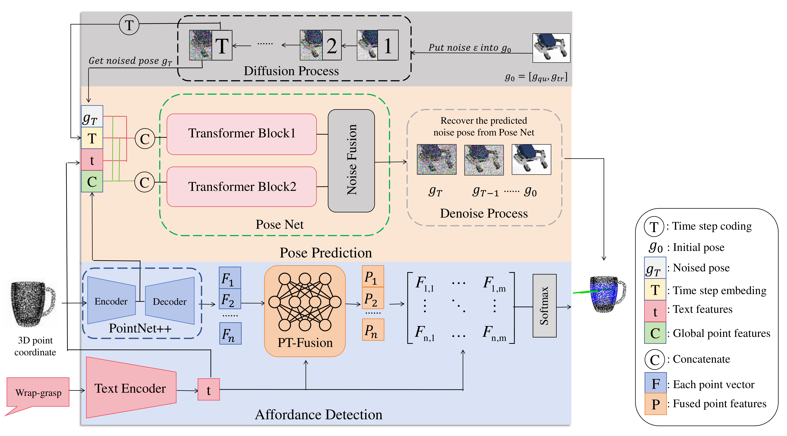

<div align="center">

# PTN-Net: Point Transformer Noise Fusion Network for Affordance-Pose Prediction in 3D Point Cloud




To address the task of language-driven affordance-pose detection in 3D point clouds. Our method simultaneously detect open-vocabulary affordances and generate affordance-specific 6-DoF poses. We present PTN-Net, a new method for affordance-pose joint learning. Given the captured 3D point cloud of an object and a set of affordance labels conveyed through natural language texts, our objective is to jointly produce both the relevant affordance regions and the appropriate pose configurations that facilitate the affordances.

</div>


## 1. Environment deployment
We strongly encourage you to create a separate conda environment.

    conda create -n affpose python=3.8
    conda activate affpose
    conda install pip
    pip install -r requirements.txt

## 2. Dataset
Our 3DAP dataset is full_shape_release.pkl .

## 3. Training
Current framework supports training on a single GPU. Followings are the steps for training our method with configuration file ```config/detectiondiffusion.py```.

* In ```config/detectiondiffusion.py```, change the value of ```data_path``` to your downloaded pickle file.
* Change other hyperparameters if needed.
* Run the following command to start training:

		python3 train.py --config ./config/detectiondiffusion.py

## 4. Open-Vocabulary Testing
Executing the following command for testing of your trained model:

    python3 detect.py --config <your configuration file> --checkpoint <your  trained model checkpoint> --test_data <test data in the 3DAP dataset>

Note that we current generate 2000 poses for each affordance-object pair.
The guidance scale is currently set to 0.5. Feel free to change these hyperparameters according to your preference.

The result will be saved to a ```result.pkl``` file.

## 5. Visualization
To visuaize the result of affordance detection and pose estimation, execute the following script:

                python3 visualize.py --result_file <your result pickle file>

## 6.Model_valuation
We prepared the evaluate_results.py to test the results and calculate the metrics.

                python3 evaluate_results.py ----result   <Path to result .pkl file>
